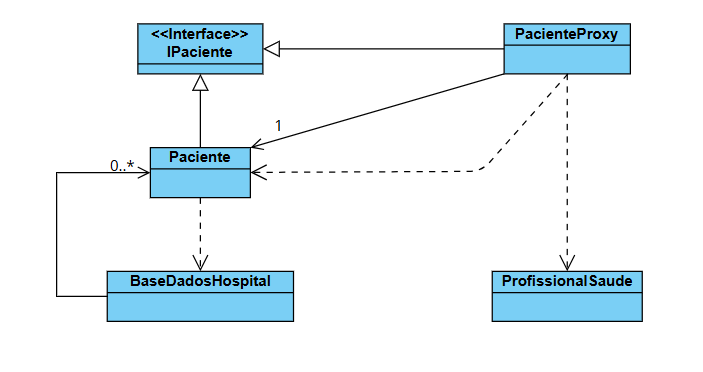

# Padrão de Projeto Proxy - Sistema Hospitalar

Este projeto apresenta um exemplo prático da implementação do padrão estrutural **Proxy** em Java, aplicado a um contexto hospitalar.

O objetivo é demonstrar como o padrão pode ser utilizado para:
1.  **Carregamento Sob Demanda**: O objeto real (Paciente) só é criado/buscado no banco de dados quando seus dados são efetivamente solicitados.
2.  **Controle de Acesso**: Apenas profissionais autorizados (médicos) podem acessar dados sensíveis (diagnósticos).

## Estrutura do Projeto

* **IPaciente (Interface)**: Define o contrato comum tanto para o objeto real quanto para o proxy.
* **Paciente (Objeto Real)**: Representa o paciente carregado do banco de dados. A sua criação é considerada uma operação custosa (simula acesso a disco/BD).
* **PacienteProxy (Proxy)**: Intercepta as chamadas ao objeto `Paciente`.
    * Gerencia a instância do objeto real (cria apenas se for `null`).
    * Verifica as permissões do `ProfissionalSaude` antes de retornar dados sensíveis.
* **ProfissionalSaude**: Representa o utilizador do sistema que tenta aceder aos dados. Possui uma flag `medico` que define o nível de acesso.
* **BaseDadosHospital**: Simula um banco de dados em memória utilizando um `HashMap`.

## Regras de Negócio Implementadas

1.  **Dados Gerais**: Qualquer profissional pode consultar dados básicos (Nome, Idade).
2.  **Dados Sensíveis**: O método `obterDiagnostico` lança uma exceção `IllegalArgumentException` se o profissional não for um médico (`isMedico() == false`).
3.  **Performance**: O construtor da classe `Paciente` (que simula a busca no BD) só é executado na primeira chamada a qualquer método do `PacienteProxy`.

## Diagrama de Classes

